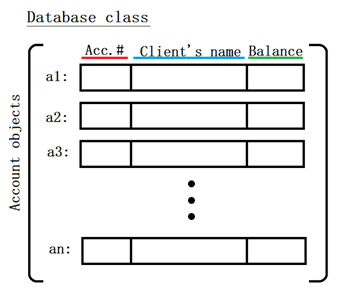
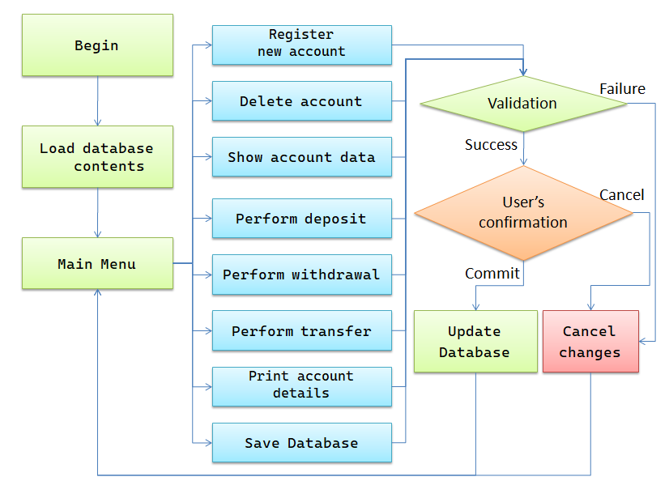

# Bank Management System

Nowadays, bank operations greatly depend on digital systems where all their customers' data are stored and handled. Due to this fact, economical institutions greatly invest for the development and maintenance of such systems, from which is the source of the Bank’s income, reputation and finally its commercial success. It is of extreme importance to produce a reliable, efficient and secure environment to work with.

Therefore, the project is to develop a Bank Management System in C++ with an object oriented programming approach (OOP), with the objective to perform the most important operations and handling customers data from a Database. 

# Solution Design and Implementation

The system is organized in two main classes, the Database and Account. 

The Account class is used to handle specific client data. The Account Number, Client’s Name and Balance were the chosen attributes to represent an Account. The criteria used for selecting the mentioned parameters is to:
1- have an unique identifier for the Client (the Account ID), 
2- a personal identifier of the Client (the Client’s name), and finally
3- a numerical decimal value that represents the Balance used in the operations.
Evidently, further attributes, such as e.g. client’s address, telephone number, nationality, etc; could have been implemented for each account. For the project purpose, the attention was focused more on its main operations and functionalities rather than expanding such attributes which would not cause different results (at storage level, these would be simply implemented as more columns at the Database file, later discussed).

 Account Number parameter was implemented as an unsigned int type, due to its greater capacity compared with “int” (assuming that the account number can be only a positive integer).

 Client’s name (or simply “name”) was implemented as “string”.

 Balance (double type). 

Meanwhile, the Database class is used to manage and store all clients data. It is organized as an array of Account objects (Account*, as a pointer), and it also contains the database current size.

Fig. 1. Representation of the database class.

All the current data stored at the Database class (namely, the array of Accounts) can be saved or loaded from an external “.csv” file. This file extension was chosen for its convenience for organizing all data as a matrix, each row representing all data of a client, and each column with the same value attribute type.

# The algorithm

Once the program is executed, the program reads and loads the contents from the default “Database.csv” file located . If the file is not found, then the program creates a new, empty one. 
	
Next, the Main Menu options are displayed:

●	(1) Register a new account...
●	(2) Delete account...
●	(3) Show account data...
●	(4) Perform deposit...
●	(5) Perform withdrawal...
●	(6) Perform transfer...
●	(7) Print all database contents...
●	(8) Save the current Database to file...
●	(9) Load Database from file...
●	(0) Exit…

A switch case structure then calls a corresponding function according to the user’s decision. 

Fig. 2. Flowchart of the system functionality.

The functions contain all instructions and I/O management, e.g displays all messages and receives all user’s inputs. 
For instance, the function “menu_reg_new_acc” is called once the user selects option (1), “Register a new account”. Next, further instructions are displayed, guiding the user to complete the operation.
Every function is equipped with multiple verifications of the inputs, and exception messages for maintaining information.
As a design criteria, before the final execution of any operation, a confirmation page with all the operation details is displayed, in order to avoid human errors.

# Account ID number generation

A trivial feature for the Account ID is for it to be unique in the database, i.e. no client can be assigned the same Account ID of another.
For that reason, the system automatically assigns one for an account at its creation. The criteria used is that the next integer of the last registered account (which is also the greatest number) at the system is assigned.
For instance, if the last registered account number has ID “156”, then the system will assign the ID number “157” for the next created account, since the new accounts are inserted at the end of the database (similarly to executing “push” to a stack).
It provides the advantage that the new number generated was never used before, even former clients with the account deleted . This fact ensures that newer clients would not be mistaken with former ones if a superior institution would perform investigations at these accounts.

# Exception Management

Located in the critical parts of the program (i.e. while opening a file), custom Exceptions are called on occasion. The system contains the following:

●	Wrong Input Exception: Called when the input given by the user is invalid (for instance, if a number is entered for the client’s name registration. 

●	File Open Exception: Called when the file could not be created or readed.

●	File Save Exception: Called when writing in the database file was not successful.
Exception handling is implemented in order to provide concise information for the user and to improve the code readability. 

